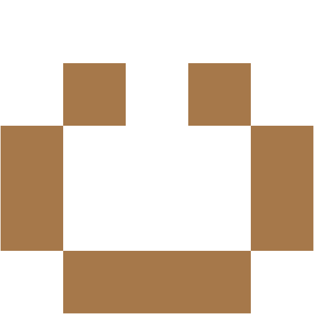

# Avatar Generator

This program generates 512x512 px images containing horizontally mirrored
icons like this:



It is used internally by Keera Studios to generate random images for mobile
Haskell demo applications.

If you like it, star it. As it is used in a very specific environment and it
serves its purpose, there are no plans to improve it. However, if you want,
feel free to fork it and send pull requests.


Usage:
```
$ cabal sandbox init
$ cabal update
$ cabal install avatar-generator
$ cabal exec avatar-generator avatar.png
```
